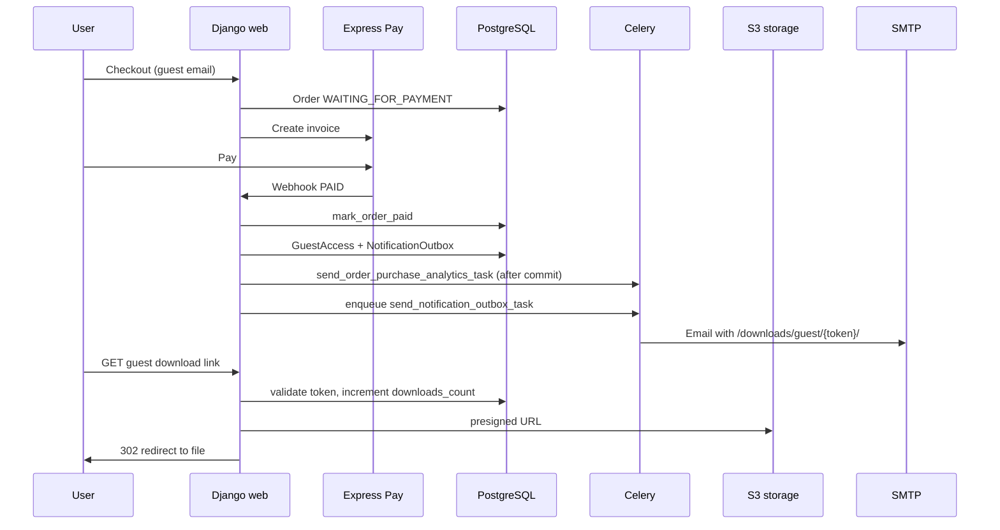
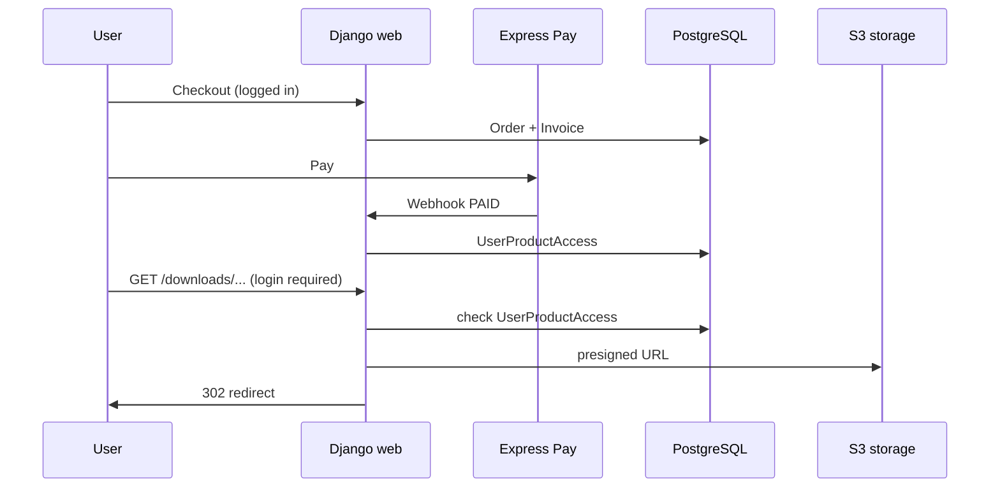

# PalinGames — архитектура

Краткая карта системы: как запрос пользователя превращается в заказ, оплату и выдачу цифрового файла.

Операционные детали (env, docker, runbooks) — в [README](../README.md) и [deploy/README.md](../deploy/README.md).

---

## Обзор

PalinGames — server-rendered Django-магазин цифровых товаров. Основной стек:

| Слой | Технологии |
|------|------------|
| Web | Django 5.2, templates, htmx, Tailwind |
| Данные | PostgreSQL 16, Redis |
| Фон | Celery + django-celery-beat |
| Файлы | S3-compatible storage (MinIO dev / Contabo prod) |
| Платежи | Express Pay (webhook + периодический sync) |
| Уведомления | `NotificationOutbox` → email (SMTP) / Telegram (Redis Streams → bot) |
| Наблюдаемость | JSON logging, Prometheus, Sentry, Telegram incidents |

```text
                         ┌─────────────┐
   Browser ────────────► │ Caddy/proxy │ ──► Django (web)
                         └─────────────┘         │
                                                 ├──► PostgreSQL
                                                 ├──► Redis (cache, Celery, rate limit, Telegram streams)
                                                 └──► S3 (product files, previews)

   Express Pay webhook ──► Django (web)
   Celery worker/beat ───► PostgreSQL, Redis, S3, SMTP
   telegram-bot ─────────► Redis Streams ──► Telegram Bot API
```

---

## Django-приложения

| Приложение | Ответственность |
|------------|-----------------|
| `apps/products` | Каталог, карточка, отзывы, `ProductFile`, S3 upload/download |
| `apps/cart` | Guest cart (session) и user cart (DB), merge при логине |
| `apps/orders` | Checkout, `Order` / `OrderItem`, промокоды |
| `apps/payments` | `Invoice`, webhook Express Pay, sync pending invoices |
| `apps/access` | `UserProductAccess`, `GuestAccess`, download endpoints |
| `apps/managed_links` | Постоянные QR-ссылки `/go/<token>/`, S3 bucket `qr-assets`, admin upload, QR export |
| `apps/notifications` | `NotificationOutbox`, handlers, Celery delivery |
| `apps/emails` | `EmailLog`, `EmailSuppression`, единая точка SMTP |
| `apps/users` | Кастомный user, allauth headless, OAuth, consent |
| `apps/pages` | Контентные страницы, личный кабинет |
| `apps/custom_games` | Заказ индивидуальной игры (отдельный payable flow) |
| `apps/promocodes` | Промокоды и redemption |
| `apps/favorites` | Избранное |
| `apps/core` | Logging, health, metrics, incidents, SEO, analytics hooks |

Вне `apps/`: `libs/express_pay` — HTTP-клиент и модели Express Pay; `bot/telegram_bot` — отдельный сервис доставки в Telegram.

---

## Основные сущности

```text
Product ──► ProductFile (S3 key, один active archive на продукт)
            is_published — видимость на витрине (default False для новых)
Order ──► OrderItem(s)
Order ──► Invoice (Express Pay provider_invoice_no, status)
Invoice ──► PaymentEvent (idempotency / audit)

После оплаты:
  Authenticated ──► UserProductAccess (user + product, permanent)
  Guest         ──► GuestAccess (token hash, expiry, download limit)

NotificationOutbox ──► encrypted payload ──► Celery ──► email / Telegram stream

ManagedLink (QR materials, вне commerce flow):
  token (urlsafe) ──► s3_file_key в bucket qr-assets ИЛИ external_url (Yandex Disk и т.п.)
  is_active=False по умолчанию; после finalize upload ──► is_active=True
  QR кодирует только https://{SITE_BASE_URL}/go/{token}/ — не S3 и не external URL
```

---

## Managed links (QR materials)

Отдельный поток для раздачи игровых материалов по постоянным QR-ссылкам. **Не связан** с `Order`, `UserProductAccess`, `GuestAccess`.

```text
Staff (admin)
  → ManagedLink (title, optional external_url, draft is_active=False)
  → Save → presign → browser PUT в qr-assets → finalize → is_active=True
  → QR PNG (с logo-qr-mark) / SVG (plain) из admin

Пользователь (без auth)
  → GET /go/<token>/
  → если active: 302 на presigned S3 download ИЛИ external_url
  → если S3 недоступен и есть external_url: fallback redirect
  → rate limit: 60/min/IP (ответ 404, как для unknown token)
```

| Компонент | Bucket / storage |
|-----------|------------------|
| Материалы (PDF, images) | `S3_MANAGED_LINKS_BUCKET_NAME` (default `qr-assets`), private |
| Ключ объекта | `{token}/{uuid4}.{ext}` |
| Custom QR logo (optional) | Django `ImageField` → `managed_links/qr_logos/` (container FS) |
| Default QR logo | `static/images/logo-qr-mark.png` (Whitenoise) |

Подробнее: [deploy/README.md](../deploy/README.md#managed-links-qr-materials-bucket-qr-assets), [runbooks.md](runbooks.md).

---

## Жизненный цикл заказа

```text
CREATED
   │
   ▼
WAITING_FOR_PAYMENT  ◄── create_invoice_task, invoice URL пользователю
   │
   ├──► PAID          ◄── webhook или sync_waiting_invoice_statuses_task
   │      │
   │      └──► REFUNDED   ◄── возврат на стороне провайдера (терминальный)
   ├──► CANCELED
   └──► FAILED
```

Статусы определены в `apps/orders/models.py` (`Order.OrderStatus`).

Checkout создаёт заказ и ставит invoice в очередь; fulfillment (`mark_order_paid`) срабатывает только при переходе invoice → `PAID`.

### Правила переходов статуса invoice

Доставка webhook не упорядочена, поэтому переходы из расчётных статусов ограничены
(`ALLOWED_TRANSITIONS_FROM_TERMINAL_STATUS` в `apps/payments/services.py`):

| Текущий статус invoice | Что принимается | Что происходит с остальным |
|------------------------|-----------------|----------------------------|
| `PAID` | `PAID` (идемпотентный повтор), `REFUNDED` | опоздавшие `PENDING` / `EXPIRED` / `CANCELED` игнорируются, пишется `payment.status.regression_ignored` |
| `REFUNDED` | `REFUNDED` | возврат терминальный, повторный `PAID` не воскрешает заказ |

При возврате `order.paid_at` намеренно сохраняется (нужен для сверки), выставляется
`order.refunded_at`, уже выданный доступ к файлам **не отзывается** — возврат разбирается вручную.

### Статусы провайдера, которые не маппятся

`map_invoice_status` покрывает не все коды Express Pay. `PARTIALLY_PAID` (4) и `PAID_BY_CARD` (6)
намеренно не отображаются: оплата картой не подключена. Любой неизвестный код не меняет состояние
заказа, но пишет `payment.status.unmapped`, инкрементит `payment_unmapped_provider_status_total`
и поднимает incident alert — то есть не теряется молча.

**При подключении карт** нужно добавить `PAID_BY_CARD → PAID`. `PARTIALLY_PAID` выдавать товар
не должен: под него нужен отдельный статус и ручной разбор.

---

## Покупка: от корзины до файла

### 1. Корзина

- **Guest:** product IDs в session (`guest_cart_product_ids`), см. `apps/cart/services.py`.
- **User:** `Cart` / `CartItem` в PostgreSQL.
- **Merge:** signal `user_logged_in` → `merge_guest_cart_to_user()` в `apps/cart/signals.py` (пропускает уже купленные товары).

### Видимость товара на витрине (`is_published`)

| Зона | Поведение |
|------|-----------|
| Каталог, алфавит, search suggest, sitemap | только `Product.objects.published()` |
| Карточка товара | 404 для гостей; staff (`is_staff`) видит preview |
| Корзина / избранное / checkout | только опубликованные; при снятии с публикации checkout блокируется с сообщением |
| Скачивание, заказы, watchdog | **без** фильтра — доступ по покупке сохраняется |

Миграция `products.0009_product_is_published`: добавляет поле и выставляет `is_published=True` всем существующим товарам.

### 2. Checkout

Entry: `apps/orders/services.py` — создание `Order` из корзины, idempotency key в session, промокод, consent.

После создания заказа → `enqueue_invoice_creation` → Celery `create_invoice_task` → Express Pay API → `Invoice` в статусе `PENDING`, заказ `WAITING_FOR_PAYMENT` → `ensure_invoice_created_user_email` (письмо со ссылкой).

**Устойчивость создания инвойса:**

| Механизм | Поведение |
|----------|-----------|
| Retry | Transport, HTTP 429/5xx — до 5 попыток, backoff до 10 мин; `ExpressPayAPIError` и idempotent skip — без retry |
| Логи | `invoice.creation.retry_scheduled` при retry; `invoice.creation.failed` — финальный провал |
| Watchdog | Тот же `check_paid_order_delivery_watchdog_task`: заказы `CREATED` / `WAITING_FOR_PAYMENT` без полного инвойса старше 10 мин (lookback 48 ч) → `payment_invoice_missing` |
| Incident | `payments.invoice_creation.missing` (dedupe 15 мин), отдельно от `orders.delivery.invariant` |

При редком сбое «Express Pay ответил OK, запись в БД не успела» retry может создать **второй** счёт у провайдера; в БД один инвойс на заказ, клиент получает актуальную ссылку. Лишний pending-счёт у провайдера допустим; восстановление — админка «Создать инвойс» или повтор `create_invoice_task`.

### 3. Оплата (два канала)

**A. Webhook (основной путь)**

```text
POST /payments/express-pay/notification/
  → apps/payments/views/express_pay.py
  → verify signature, idempotent PaymentEvent
  → select_for_update на Order
  → mark_order_paid (если status PAID)
```

**B. Polling (fallback)**

```text
Celery Beat: sync_waiting_invoice_statuses_task (каждые ~5 мин)
  → apps/payments/tasks.py
  → Express Pay status API
  → тот же apply_order_status_from_invoice_status / mark_order_paid
```

Оба канала используют общий доменный код в `apps/payments/services.py`.

### 4. Fulfillment после оплаты

`mark_order_paid()` (`apps/payments/services.py`):

| checkout_type | Действие |
|---------------|----------|
| `AUTHENTICATED` | `grant_user_product_accesses(order)` — `UserProductAccess` |
| `GUEST` | `create_guest_access_notification_for_order(order)` — `GuestAccess` + email outbox |

Дополнительно (один раз на первый переход в PAID):

- `issue_order_reward_after_payment` — промокод за заказ
- GA4 / Yandex Metrica purchase events: `transaction.on_commit` → `send_order_purchase_analytics_task` (`apps/core/tasks.py`, Celery worker)
- Custom game flow — отдельная ветка через `mark_custom_game_request_paid`

**Idempotency:** если `order.status == PAID`, повторный webhook логирует `order.paid.duplicate` и не создаёт повторный access.

### Sequence: guest checkout



### Sequence: authenticated checkout



Presigned TTL задаётся `S3_PRESIGNED_EXPIRE_SECONDS`. Guest backend links живут дольше (expiry/limit на `GuestAccess`).

---

## NotificationOutbox

Единая очередь исходящих уведомлений (email и Telegram).

```text
Producer (orders, access, payments, auth, …)
  → NotificationOutbox (status=PENDING, encrypted payload)
  → Celery: send_notification_outbox_task(outbox_id)
  → NOTIFICATION_HANDLERS[type]
       ├── email → apps/emails/senders.py (единственный message.send())
       └── telegram → Redis Stream (не Bot API из web/celery)
```

- Payload шифруется `APP_DATA_ENCRYPTION_KEY` (Fernet).
- В Celery broker уходит только `outbox_id`, не guest tokens.
- Cleanup: `cleanup_notification_outbox_task` (Beat, 03:20).
- Recovery: `reap_stuck_notification_outbox_processing_task` (Beat, каждые 10 мин) — stale `PENDING` / `PROCESSING` старше `NOTIFICATION_OUTBOX_PROCESSING_TIMEOUT_MINUTES`; reconcile outbox → `SENT` по `EmailLog`; иначе повтор `send_notification_outbox_task`; при `attempts >= NOTIFICATION_OUTBOX_MAX_PROCESSING_ATTEMPTS` → `FAILED` + incident. Параллельные task не дублируют SMTP (skip `processing_in_progress`).
- Celery: `CELERY_TASK_ACKS_LATE`, `CELERY_TASK_REJECT_ON_WORKER_LOST`; `send_notification_outbox_task` — soft/hard time limit 90/120 с.
- Watchdog paid delivery: `guest_download_notification_stuck` для guest outbox в `PENDING`/`PROCESSING` старше timeout (→ `orders.delivery.invariant`).

Критичные типы (guest download, invoice, auth) при repeated failures → Telegram **incidents** (`apps/core/alerts.py`).

---

## Telegram: два класса сообщений

| Класс | Канал | Примеры |
|-------|-------|---------|
| Business / admin | `TELEGRAM_NOTIFICATIONS_THREAD_ID` | новый отзыв, custom game request |
| Production incidents | `TELEGRAM_INCIDENTS_THREAD_ID` | webhook failures, outbox failures, S3 down |

Доставка в Telegram:

```text
Django/Celery → Redis Stream (TELEGRAM_OUTBOUND_STREAM)
  → telegram-bot (bot/telegram_bot) — единственный holder TELEGRAM_BOT_TOKEN
  → Telegram Forum API
  → ACK stream / failed stream + feedback consumer (Beat)
```

---

## Хранение файлов

- **Download archives:** private, key `{product_slug}/{uuid}.{ext}`, presigned URL при скачивании.
- **Previews:** public prefix `previews/...` (CDN/object storage URL).
- **Managed link materials:** private bucket `qr-assets`, key `{token}/{uuid}.{ext}`.
- Admin upload: напрямую в S3, метаданные в `ProductFile` / `ManagedLink`.

Readiness (`/health/ready/`) проверяет PostgreSQL, Redis, S3 product bucket и (если задан `S3_MANAGED_LINKS_BUCKET_NAME`) bucket managed links.

---

## Failure modes и восстановление

| Симптом | Механизм | Incident key |
|---------|----------|--------------|
| Webhook не дошёл / timeout | `sync_waiting_invoice_statuses_task` | `payments.status_sync.failures` |
| Webhook signature / parse errors | reject + threshold alert | `payments.webhook.failures` |
| Duplicate webhook | `PaymentEvent` key + `already_paid` guard | metric `order_paid_duplicate` |
| Неизвестный статус провайдера | статус не применяется, alert | `payments.unmapped_provider_status` |
| Опоздавший webhook откатывает оплату | guard по терминальным статусам | metric `payment_status_regression_ignored` |
| Возврат средств | `Order.REFUNDED` + alert, доступ не отзывается | `payments.order_refunded` |
| Email не ушёл | outbox retry + retention cleanup | `notifications.outbox.failures` |
| S3 недоступен | download 5xx, ready degraded | `storage.s3.unavailable` |
| Guest link expired / limit | 410 на download view | — (expected) |
| Нет инвойса / ссылки до оплаты | retry `create_invoice_task` + watchdog | `payments.invoice_creation.missing` |
| Оплачен, но нет access/email | `check_paid_order_delivery_watchdog_task` | `orders.delivery.invariant` |

Resolved alerts поддерживаются для sync, downloads, outbox, storage (см. [runbooks.md](runbooks.md)). Для `orders.delivery.invariant` recovery пока нет.

---

## Health и метрики

| Endpoint | Назначение |
|----------|------------|
| `/health/live/` | Процесс жив (Docker healthcheck web) |
| `/health/ready/` | PG + Redis + S3 + optional `managed_links_s3` |
| `/metrics/` | Prometheus (внутренняя сеть / не через публичный Caddy) |

Ключевые метрики: `order_paid`, `payment_webhook_*`, `product_download_*`, `health_readiness_check`, outbox counters — см. [metrics.md](metrics.md).

---

## Entry points (код)

| Задача | Файл |
|--------|------|
| Checkout | `apps/orders/services.py`, `apps/orders/views.py` |
| Create invoice | `apps/payments/tasks.py::create_invoice_task` |
| Webhook | `apps/payments/views/express_pay.py` |
| Mark paid + fulfillment | `apps/payments/services.py::mark_order_paid` |
| Guest access | `apps/access/services.py` |
| Guest download | `apps/access/views.py::GuestProductDownloadView` |
| User download | `apps/products/views.py` (access check + presigned) |
| Managed link redirect | `apps/managed_links/views.py`, `apps/managed_links/services/redirect.py` |
| Managed link admin upload | `apps/managed_links/admin_upload_views.py` |
| QR generation | `apps/managed_links/services/qr.py` |
| Purchase analytics (GA4 / Yandex) | `apps/core/tasks.py::send_order_purchase_analytics_task` |
| Outbox send | `apps/notifications/tasks.py`, `apps/notifications/services.py` |
| Order delivery watchdog | `apps/orders/watchdog.py`, `apps/orders/tasks.py` |
| Cart merge | `apps/cart/signals.py`, `apps/cart/services.py::merge_guest_cart_to_user` |
| Periodic tasks | `apps/core/management/commands/setup_periodic_tasks.py` |
| Incidents | `apps/core/alerts.py` |
| Express Pay client | `libs/express_pay/client.py` |

---

## Deploy (кратко)

```text
GitHub Actions (main): ruff → Django tests → build/push Docker images (web + bot)
VPS staging: scripts/deploy_remote_staging.sh  (web + celery, no bot)
VPS prod:    scripts/deploy_remote.sh          (web + celery + telegram-bot)
       → pull → migrate (run --rm) → up -d → /health/ready/ → setup_periodic_tasks → .deploy-state
```

Prod/staging: `palingames.by` / `dev.palingames.by`, shared reverse proxy, Cloudflare origin firewall.

Подробный runbook: [deploy/README.md](../deploy/README.md#деплой-обновлений-scriptsdeploy_remote-sh).

---

## Связанные документы

- [README](../README.md) — локальный запуск, env, Celery
- [deploy/README.md](../deploy/README.md) — production compose, CI/CD, VPS
- [observability.md](observability.md) — logging, metrics, incidents
- [runbooks.md](runbooks.md) — типовые инциденты
- [metrics.md](metrics.md) — PromQL и dashboards
